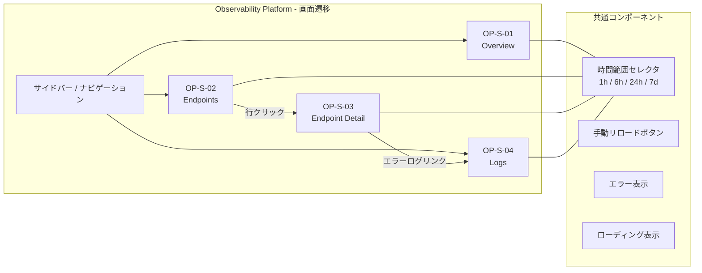

```mermaid
graph LR
    subgraph "Observability Platform - 画面遷移"
        NAV[サイドバー / ナビゲーション]
        NAV --> OV[OP-S-01<br/>Overview]
        NAV --> EP[OP-S-02<br/>Endpoints]
        NAV --> LG[OP-S-04<br/>Logs]
        EP -->|行クリック| ED[OP-S-03<br/>Endpoint Detail]
        ED -->|エラーログリンク| LG
    end

    subgraph "共通コンポーネント"
        TS[時間範囲セレクタ<br/>1h / 6h / 24h / 7d]
        RL[手動リロードボタン]
        ER[エラー表示]
        LD[ローディング表示]
    end

    OV --- TS
    EP --- TS
    ED --- TS
    LG --- TS
```
