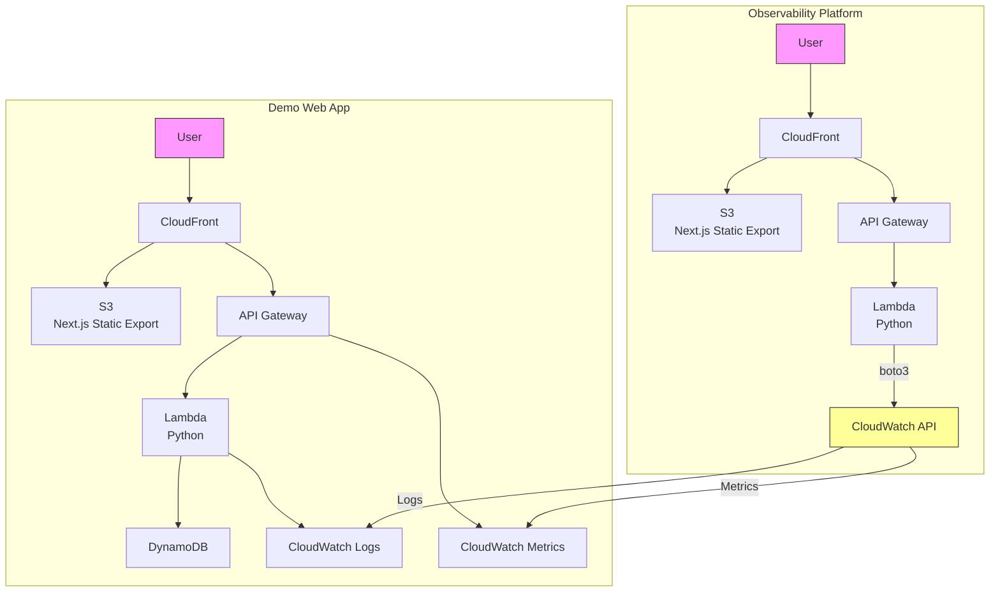

```mermaid
graph TB
    subgraph "Demo Web App"
        U[User] --> CF1[CloudFront]
        CF1 --> S3[S3<br/>Next.js Static Export]
        CF1 --> APIGW1[API Gateway]
        APIGW1 --> LMB1[Lambda<br/>Python]
        LMB1 --> DDB[DynamoDB]
        LMB1 --> CWL1[CloudWatch Logs]
        APIGW1 --> CWM1[CloudWatch Metrics]
    end

    subgraph "Observability Platform"
        U2[User] --> CF2[CloudFront]
        CF2 --> S3_2[S3<br/>Next.js Static Export]
        CF2 --> APIGW2[API Gateway]
        APIGW2 --> LMB2[Lambda<br/>Python]
        LMB2 -->|boto3| CWAPI[CloudWatch API]
    end

    CWAPI -->|Metrics| CWM1
    CWAPI -->|Logs| CWL1

    style U fill:#f9f,stroke:#333
    style U2 fill:#f9f,stroke:#333
    style CWAPI fill:#ff9,stroke:#333
```
